# LoneWolf Digital Forensic Investigation

This project is a digital forensic investigation into a live-acquired disk image (`LoneWolf.E01`) from a Dell Latitude laptop, examined as part of a university cyber forensics unit (ICT600). The scenario: a subject, Jim Cloudy, planning a mass-casualty attack at a public town hall event, apprehended after his brother, Paul, found planning documents in shared cloud storage.

This was a group assignment — the write-up below covers the sections I was individually responsible for: system and user profiling, attack planning document analysis, escape plan reconstruction, and cloud storage artefact tracing.

**Tools used:** Autopsy 4.23.1, FTK Imager Lite 3.1.1.8, OSForensics 11.1

**Evidence source:** `LoneWolf.E01` — verified via MD5/SHA1 hashing before and after analysis to confirm forensic integrity.

---

## System & User Profiling

The target machine was a Dell Latitude E6430 ATG (hostname `DESKTOP-PM6C56D`), running Windows 10 Education, Intel i5-3340M, 16GB RAM.

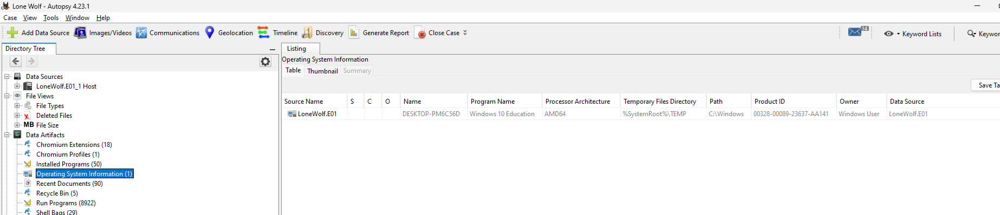

Only one active local account existed on the system — `jcloudy` — confirmed by cross-checking Autopsy's OS Account module against the SAM database (`C:\Windows\System32\config\SAM`) directly.

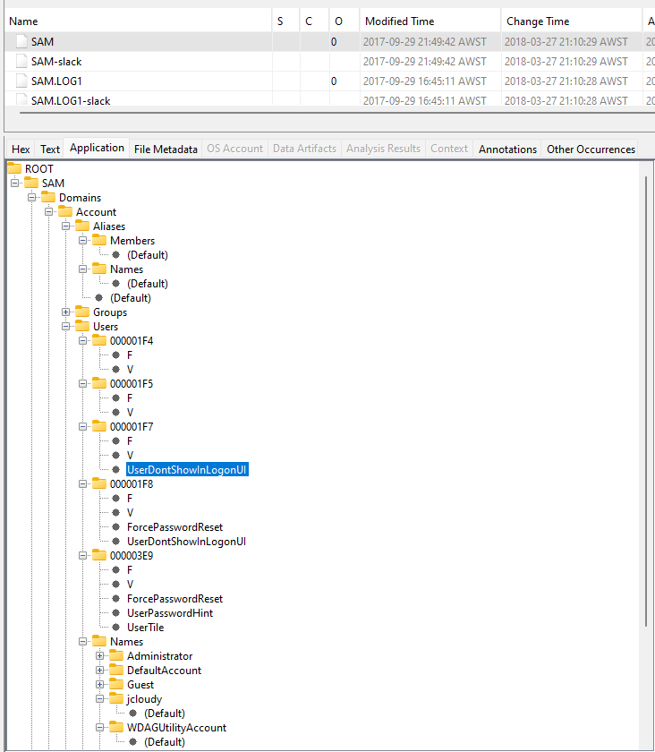

One detail worth calling out: the SAM database's last-modified timestamp matched the date the account was created, which lined up with the case narrative that the laptop had been wiped and handed over as a replacement device days before the account was set up.

The `jcloudy` account was linked to two external identities — a Microsoft account (`jimcloudy@outlook.com`, used for OneDrive) and a Google account (`jimcloudy1@gmail.com`, used across Drive, Dropbox, Box, and AWS).

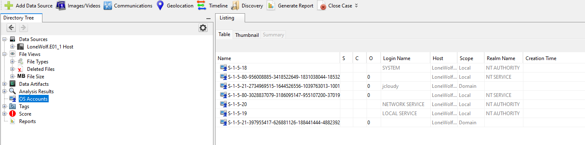

Installed software told its own story: Office 365 went in the same day the account was created, and within a nine-day window, four separate cloud sync clients (Box, Dropbox, Google Backup & Sync, S3 Browser) were all installed and configured to the same Google account — a pattern that only made sense once cross-referenced against the cloud distribution findings later in the report.

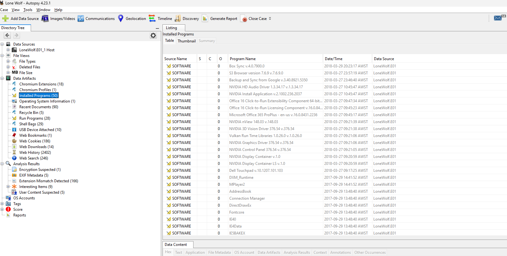

No encryption, anonymisation, or anti-forensic tooling was found on the system.

---

## Attack Planning Documents

Three documents formed the core of the attack planning evidence, all recovered from the `jcloudy` Desktop and cross-referenced through Recent Documents artefacts, link files, and Office metadata.

**Planning.docx** — the primary planning document, structured as a four-part checklist: Target, Supplies, Escape, Release. The venue (Cascades Library) ticked every box Jim had written down — gun-free zone, good escape route, close to an airport. Metadata showed 9 revisions and over 43 hours of total editing time, which rules out anything impulsive.

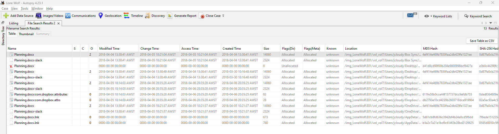
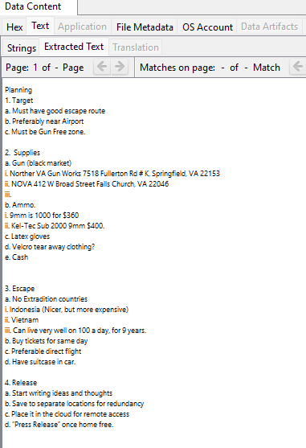
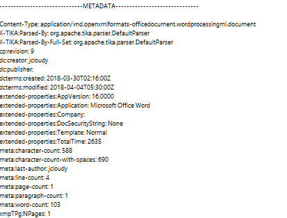

**Operation 2nd Hand Smoke.pptx** — this one's mostly images, only 12 words of actual text across 7 slides, but it's the most damning file in the case. It walks through the entire operation visually: the event listing, a Street View shot of the library entrance, an annotated satellite map with parking and escape routes marked, driving directions to Dulles Airport, a flight search, and a hotel booking in Bali. Created and finished within 24 hours of the attack date.

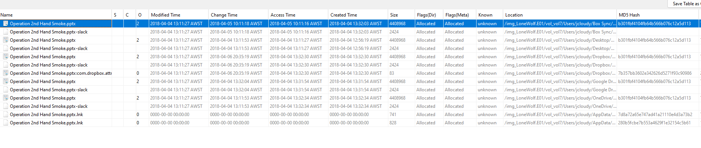
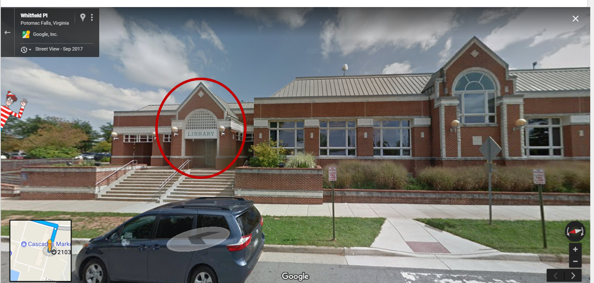
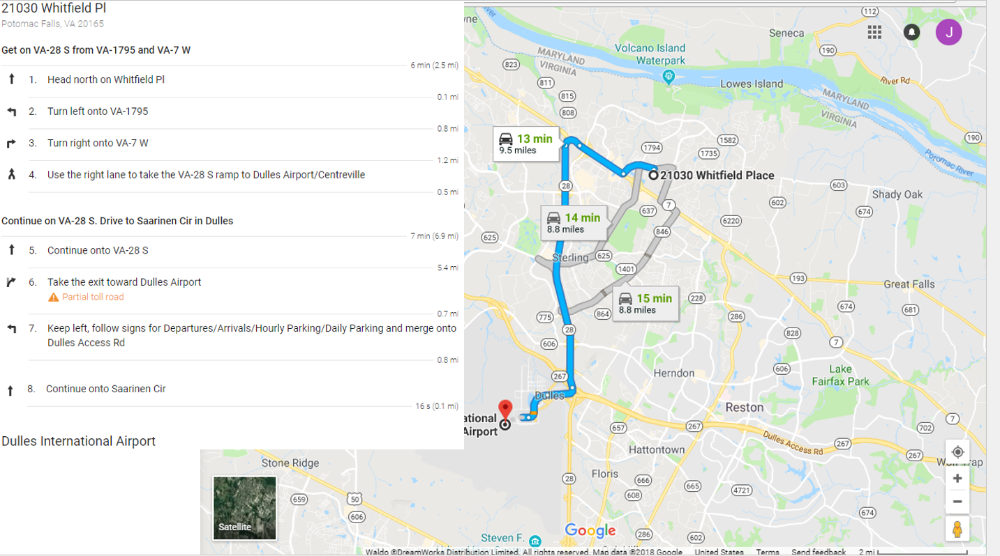

**Cloudy thoughts (4apr).docx** — a journal entry written in a single seven-minute session the morning before the attack. Unlike the other files, it was never synced to cloud storage — it was probably written after the last sync cycle ran. One line stood out: *"I am saving everything to the cloud on several accounts. I don't want my thoughts deleted."* That single sentence ties directly into the cloud distribution findings covered next.

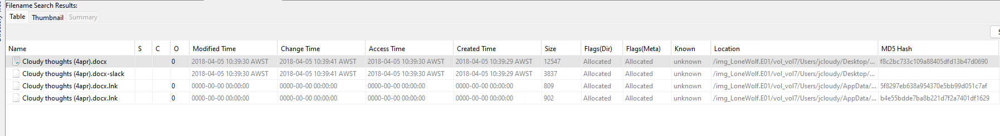
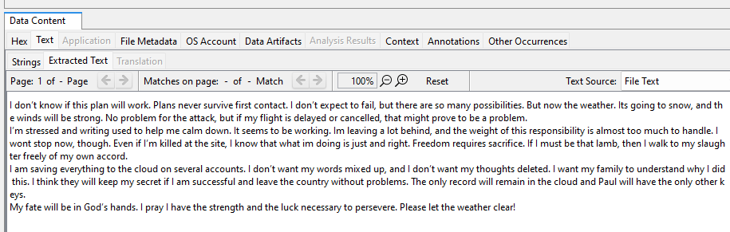

---

## Escape Plan

**AIRPORT INFORMATION.docx** was the key document here — found on the Desktop, last opened 4 April, created 30 March. What's notable is the editing time: 9 revisions, 78+ hours total. That's not a document someone wrote once and forgot about — it was actively refined right up until days before the attack.

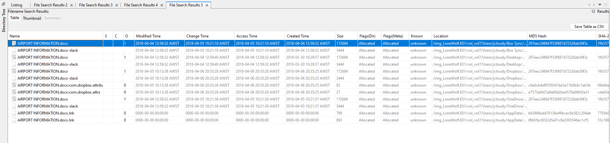

The document compares two departure airports — Reagan National (praised for on-time departures) and Dulles (chosen for its direct flights to Indonesia). There's also a travel-time note from a completely different address near Fairfax, which hints an earlier target location may have been considered before Jim settled on Cascades Library.

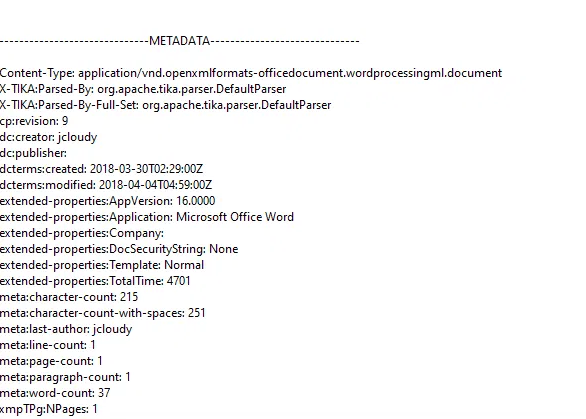

An embedded screenshot inside the doc shows an American Airlines booking already at the passenger-details stage — a round trip to Bali, departing the day of the attack. Booking that far into the flow means this wasn't casual research; it was an active purchase attempt.

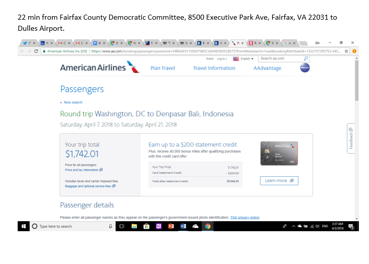

This cross-checks cleanly against the escape route mapped out in Operation 2nd Hand Smoke.pptx (from the previous section) — driving directions to Dulles, a Korean Air flight search departing 50 minutes after the attack's scheduled start, and a Bali hotel booking. Two separate documents, two separate airlines researched, same departure date. That's not coincidence — it's contingency planning.

---

## Cloud Distribution Materials

This was the section that tied everything together. Four cloud sync clients — Box, Dropbox, Google Backup & Sync, and OneDrive — were all installed and linked to Jim's accounts within days of each other. That's not accidental; Planning.docx says it outright: *"Save to separate locations for redundancy"* and *"Place it in the cloud for remote access."*

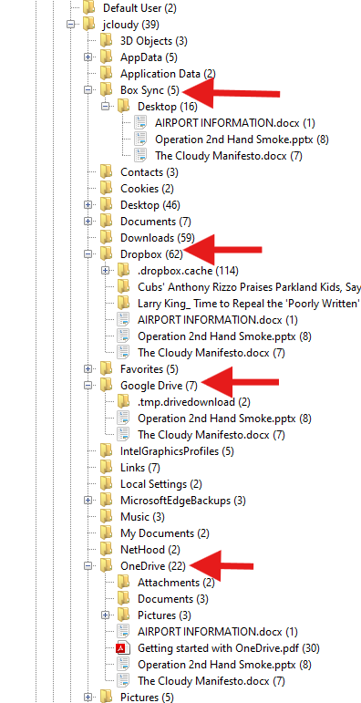

Searching for the key planning documents across each service turned up a clear pattern:

| Document | Box | Dropbox | Google Drive | OneDrive |
|---|---|---|---|---|
| Planning.docx | ✔ | ✔ | ✖ | ✔ |
| Operation 2nd Hand Smoke.pptx | ✔ | ✔ | ✔ | ✔ |
| AIRPORT INFORMATION.docx | ✔ | ✔ | ✖ | ✔ |
| The Cloudy Manifesto.docx | ✔ | ✔ | ✔ | ✔ |

Every synced copy matched the MD5 hash of the Desktop original, so nothing had been altered in transit — just mirrored across platforms. The two documents missing from Google Drive were likely saved after the last sync cycle ran rather than deliberately withheld.

On top of the four sync clients, a file called `rootkey.csv` turned up in Downloads — live AWS credentials for an S3 bucket named "cloudy-thoughts." It was downloaded 28 March and then opened again at 20:27 on 6 April — hours after the arrest. That reopen timing is the kind of detail that raises more questions than it answers: an attempt to check the bucket, wipe it, or just habit.

The last piece came via the keylogger dataset: at 3:16 AM on the morning of the arrest, Jim was editing a shared Google Doc with Paul, listing login credentials for Gmail, Dropbox, Box, and Google Drive — which is exactly how that access (and the eventual tip-off) happened.

Four synced platforms plus a dedicated S3 bucket isn't redundancy for convenience — it's redundancy built so the plan would survive even if the laptop didn't.

---

## Summary & Conclusions

Taken together, the evidence across these sections built a consistent, corroborated picture rather than a single smoking gun. The planning documents laid out intent and method. The escape plan showed that intent extending into concrete logistics — flights researched across two airlines, a hotel booked, driving times calculated to the minute. And the cloud distribution pattern showed a level of premeditation that went beyond just writing a plan down: multiple platforms, redundant copies, even a dedicated AWS bucket, all set up specifically so the plan would survive the loss of the device itself.

What made this case interesting from a forensics standpoint wasn't any single artefact — it was how consistently independent sources lined up. Document metadata, browser history, cloud sync timestamps, and keylogger screenshots all corroborated each other without contradiction. That kind of cross-source consistency is what turns a pile of files into a reliable timeline.

The one gap worth noting: the original laptop was destroyed before the investigation began, and the replacement drive was wiped before handoff — so this analysis is necessarily built on a nine-day window rather than the full history of planning. That's a limitation of the evidence, not the methodology.
